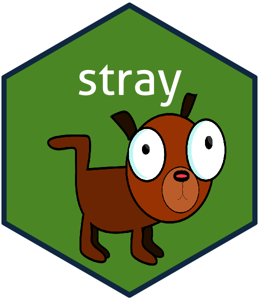

# stray
Multinomial Logistic-Normal Linear Regression Models

## Citation ##
The paper is currently being written. Cite how you like till then :)

## License ##
All source code freely availale under [GPL-3 License](https://www.gnu.org/licenses/gpl-3.0.en.html). 

## Installation ##
``` r
devtools::install_github("jsilve24/stray", build_vignettes=TRUE)
```

## Bugs/Feature requests ##
I appreciate bug reports and feature requests. Please post to the github issue tracker [here](https://github.com/jsilve24/stray/issues). 


